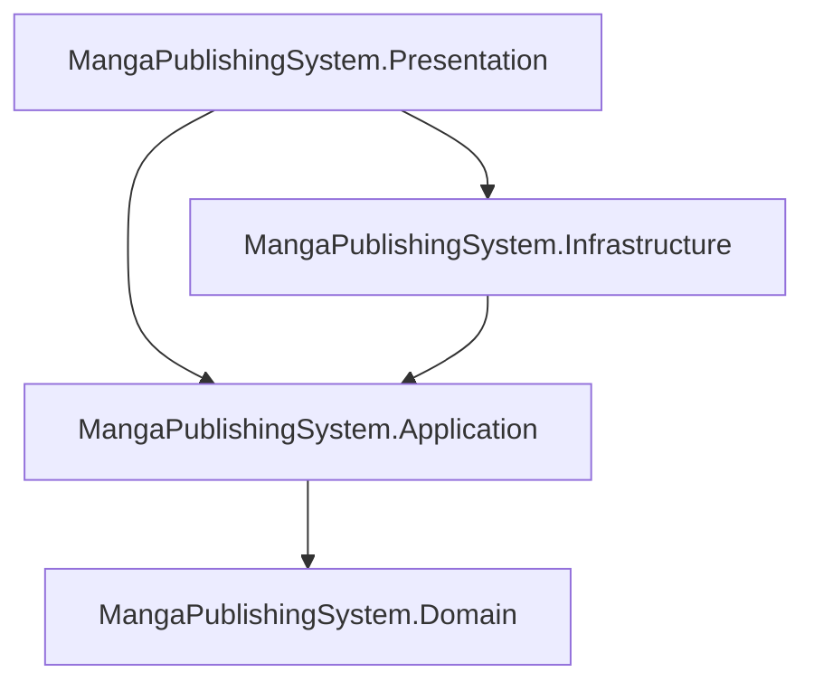

# CẤU HÌNH & QUY TẮC PHÁT TRIỂN DÀNH CHO AI (GEMINI/CLAUDE/CHATGPT)

## HỆ THỐNG MANGA PUBLISHING SYSTEM (BACKEND)

> [!IMPORTANT]
> **ĐÂY LÀ TỆP TIN CẤU HÌNH BẮT BUỘC CHO AI.**
> Mỗi khi AI bắt đầu phiên làm việc mới hoặc chuẩn bị viết mã nguồn, xây dựng API, sửa lỗi, hay thiết lập bất kỳ tính năng nào trên hệ thống này, **AI phải đọc tệp tin này đầu tiên** và tuân thủ nghiêm ngặt các quy tắc dưới đây. Không tự ý viết mã nguồn lộn xộn hay vi phạm cấu trúc kiến trúc.

## 1. YÊU CẦU ĐỌC HIỂU NGHIỆP VỤ BẮT BUỘC

Trước khi triển khai bất kỳ tính năng nào liên quan đến nghiệp vụ sáng tác, phân việc, ký hợp đồng hay thanh toán, AI phải đọc tệp tin [SRS.md](file:///d:/SWP391/Project/BE-SWP391/SRS.md) tại gốc dự án để hiểu rõ:

1. **Vai trò các Actor**: Ai được phép gọi API nào (Mangaka, Assistant, Tantou Editor, Editorial Board, System Admin).
2. **Quy tắc về tiền và ví (Wallet Rules)**: `SetupFundBalance` vs `WithdrawableBalance`.
3. **Quy tắc Escrow**: Khóa tiền cọc nhiệm vụ khi tạo task, giải ngân khi approve, hoàn tiền khi hủy task.

## 2. NGUYÊN TẮC KIẾN TRÚC NGHIÊM NGẶT (CLEAN ARCHITECTURE 4 TẦNG)

Mọi mã nguồn của các API, tính năng mới phải được tổ chức tách biệt tuyệt đối vào 4 tầng thuộc `Services/MangaPublishingSystem`:



### Quy định nội dung của từng Layer:

* **Tầng Domain (`MangaPublishingSystem.Domain`)**:
  * Chỉ chứa thực thể nghiệp vụ (`Entities`), các kiểu liệt kê (`Enums`), đối tượng giá trị (`ValueObjects`), hoặc ngoại lệ nghiệp vụ lõi (`Exceptions`).
  * **CẤM TUYỆT ĐỐI**: Tham chiếu đến các thư viện ngoài, Entity Framework, hoặc bất kỳ cấu hình DI, Controller nào.
* **Tầng Application (`MangaPublishingSystem.Application`)**:
  * Chứa Interfaces nghiệp vụ (`IServices`, `IRepositories`, `IUnitOfWork`), DTOs (`DTOs`), Trình xác thực (`Validations` dùng FluentValidation), logic nghiệp vụ (`Services`).
  * **CẤM TUYỆT ĐỐI**: Truy cập trực tiếp cơ sở dữ liệu hoặc sử dụng các lớp cụ thể của EF Core (như DbContext). Tất cả các truy xuất dữ liệu phải thông qua các interface Repository và được điều phối bởi `IUnitOfWork`.
* **Tầng Infrastructure (`MangaPublishingSystem.Infrastructure`)**:
  * Chứa DbContext (`Data/MangaPublishingDbContext`), cấu hình thực thể EF Core (`Data/Configurations`), hiện thực cụ thể của các Repository (`Repositories/` và `UnitOfWork.cs`), và các dịch vụ bên thứ ba (như VNPay Sandbox, lưu trữ ảnh Firebase/MinIO).
* **Tầng Presentation (`MangaPublishingSystem.Presentation`)**:
  * Chỉ chứa các bộ điều khiển API (`Controllers`), bộ lọc lỗi, cấu hình khởi chạy (`Program.cs`, `launchSettings.json`, `appsettings.json`), và các hàm đăng ký phụ thuộc (`Extensions/DependencyInjectionExtensions.cs`).

## 3. QUY TRÌNH THỰC HIỆN KHI AI THÊM API / CHỨC NĂNG MỚI

AI phải thực hiện tuần tự theo quy trình dưới đây, không nhảy bước:

```
[BƯỚC 1: Domain] Tạo thực thể (Entity) trong Domain
       │
       ▼
[BƯỚC 2: Application] Tạo DTOs & Trình xác thực (FluentValidation)
       │
       ▼
[BƯỚC 3: Application] Tạo Repository Interface & Service Interface + Cài đặt Service
       │
       ▼
[BƯỚC 4: Infrastructure] Đăng ký DbSet trong DbContext & Hiện thực Repository/UnitOfWork
       │
       ▼
[BƯỚC 5: Presentation] Tạo Controller & Đăng ký DI trong Extensions
       │
       ▼
[BƯỚC 6: GatewayAPI] Định tuyến Router upstream/downstream trong ocelot.json
```

## 4. HƯỚNG DẪN CẤU HÌNH & CHẠY DỰ ÁN DÀNH CHO AI

### 4.1. Cách biên dịch (Build) giải pháp

Mỗi khi chỉnh sửa mã nguồn, AI phải chạy lệnh sau tại thư mục gốc để đảm bảo hệ thống không bị lỗi cú pháp hay tham chiếu:

```powershell
dotnet build MangaPublishingSystem.slnx
```

### 4.2. Cấu hình cổng chạy (Ports) & Routing của API Gateway

* **GatewayAPI**: Chạy tại cổng **5000** (`http://localhost:5000`).
* **Manga Service (Presentation)**: Chạy tại cổng **5010** (`http://localhost:5010`).
* Mỗi khi viết một Controller mới (ví dụ: `ChaptersController` ứng với route `api/chapters`), AI **bắt buộc** phải bổ sung luật định tuyến vào cả hai tệp [ocelot.json](file:///d:/SWP391/Project/BE-SWP391/GatewayAPI/ocelot.json) và [ocelot.Development.json](file:///d:/SWP391/Project/BE-SWP391/GatewayAPI/ocelot.Development.json) của GatewayAPI:

```json
{
  "DownstreamPathTemplate": "/api/chapters/{everything}",
  "DownstreamScheme": "http",
  "DownstreamHostAndPorts": [
    {
      "Host": "localhost",
      "Port": 5010
    }
  ],
  "UpstreamPathTemplate": "/api/v1/chapters/{everything}",
  "UpstreamHttpMethod": [ "Get", "Post", "Put", "Delete", "Patch", "Options" ]
}
```

*(Lưu ý: Upstream luôn dùng tiền tố `/api/v1/...` và Downstream trỏ về đúng cổng 5010 cùng route tương ứng của controller).*

## 5. NGUYÊN TẮC VIẾT MÃ NGUỒN (CODING RULES)

* **Phân chia thư mục theo tính năng (Feature Folders)**:
  * Khi triển khai hoặc viết mã cho bất kỳ chức năng/nghiệp vụ mới nào, AI **bắt buộc phải tạo một thư mục riêng biệt đặt tên theo tính năng đó** (ví dụ: thư mục `Chapter`, `Task`, `User`, `Wallet`...) bên trong các thư mục thành phần lớn như `DTOs`, `Validations`, `Services`, `Controllers`.
  * **CẤM TUYỆT ĐỐI** tạo các tệp tin chức năng nằm lộn xộn trực tiếp dưới thư mục gốc (như `DTOs/`, `Validations/`, `Services/`, `Controllers/`) mà không phân cụm theo thư mục tính năng, nhằm đảm bảo nguồn mã được phân bổ khoa học, dễ quản lý và kiểm soát.
* **Quy tắc phân chia tầng độc lập (Clean Architecture Boundaries)**:
  * **Tầng Application (`MangaPublishingSystem.Application`)** phải luôn giữ **SẠCH** hoàn toàn, không phụ thuộc vào Entity Framework hay các thư viện hạ tầng cụ thể (`Microsoft.EntityFrameworkCore` hoặc `Microsoft.EntityFrameworkCore.Relational`).
  * Tất cả các helper truy vấn cơ sở dữ liệu (ví dụ: `WhereContainsUnsigned`) **bắt buộc phải đặt tại tầng Infrastructure** (trong thư mục `Extensions`). Tầng Application tuyệt đối không được gọi trực tiếp các phương thức mở rộng hoặc collation của EF Core.
* **Tự động hóa Kiểm toán (Audit Fields - CreateAt/UpdateAt)**:
  * Tất cả các thực thể kế thừa từ `BaseEntity` đều tự động có 2 cột `CreateAt` và `UpdateAt`.
  * **CẤM** tự cập nhật thủ công giá trị cho `CreateAt` và `UpdateAt` ở tầng nghiệp vụ (Service). `MangaPublishingDbContext.cs` đã được thiết lập tự động hóa: Gán `CreateAt = DateTime.UtcNow` khi thêm mới (Added) và `UpdateAt = DateTime.UtcNow` khi cập nhật (Modified).
  * Trong các SQL script (`schema.sql`), mọi bảng đều phải có:
    `CreateAt DATETIME2 NOT NULL DEFAULT GETUTCDATE()`,
    `UpdateAt DATETIME2 NULL`.
* **Múi giờ & Định dạng JSON**:
  * Mọi dữ liệu thời gian lưu trữ trong DB và Backend C# bắt buộc phải sử dụng **múi giờ chuẩn UTC** (`DateTime.UtcNow`).
  * Khi trả dữ liệu JSON về cho Client/FE, hệ thống sử dụng bộ chuyển đổi chung `DateTimeJsonConverter` để tự động đổi múi giờ sang giờ Việt Nam (**UTC+7**) và định dạng thân thiện: **`yyyy-MM-dd HH:mm:ss`**.
* **Phân trang dùng chung (Pagination Capped at 50)**:
  * Khi viết các API có danh sách cần phân trang, AI **bắt buộc tái sử dụng** các cấu trúc phân trang có sẵn:
    * Đầu vào: Dùng **`PagedRequest`** (đã cấu hình Getter/Setter tự động giới hạn `PageSize` tối đa là **50**).
    * Đầu ra: Dùng **`PagedResult<T>`** đóng gói danh sách `Items` kèm các siêu dữ liệu (`TotalItems`, `TotalPages`, `PageNumber`, `PageSize`, `HasNextPage`...).
    * Truy vấn DB (IQueryable): Gọi hàm mở rộng **`ToPagedListAsync(...)`** ở tầng Infrastructure.
    * Lọc bộ nhớ (IEnumerable): Gọi hàm mở rộng **`ToPagedList(...)`** trong `BuildingBlocks.Extensions`.
* **Bộ tìm kiếm dùng chung (Search Extensions)**:
  * **CẤM TUYỆT ĐỐI** tự viết mã loại bỏ dấu tiếng Việt hoặc so sánh hoa thường lặp lại. Sử dụng các tiện ích có sẵn:
    * Lọc cơ sở dữ liệu (Database level): Dùng **`WhereContainsUnsigned(...)`** ở tầng Infrastructure để thực thi collation `SQL_Latin1_General_CP1_CI_AI` không phân biệt dấu và hoa thường trực tiếp trên máy chủ SQL Server.
    * Lọc bộ nhớ (In-memory level): Dùng **`ContainsUnsigned(...)`** trong `BuildingBlocks.Extensions` để chuẩn hóa Unicode, xóa dấu và so sánh chữ thường.
* **Xác thực dữ liệu**: Bắt buộc sử dụng **FluentValidation** tự động xác thực ở tầng Application, không viết mã kiểm tra thủ công (như if-else) trong Controller.
* **Xử lý lỗi (Exception Handling)**:
  * Ném các Exception chuẩn trong `BuildingBlocks.Exceptions` (ví dụ: `NotFoundException`, `ConflictException`) ở tầng Application/Service.
  * Tầng Presentation sẽ tự động kích hoạt `GlobalExceptionMiddleware` để chuyển lỗi thành JSON chuẩn, không sử dụng khối `try-catch` bọc bừa bãi trong Controller.
* **Định dạng phản hồi**: Mọi dữ liệu trả về client từ Gateway hay API đều sẽ được chuẩn hóa qua lớp `ApiResponse<T>` của BuildingBlocks.
* **Quy tắc SignalR & WebSocket**:
  * Khi định nghĩa Hub mới (ví dụ `/hubs/my-hub`), bắt buộc phải cấu hình **2 Route định tuyến tương ứng** trong `ocelot.json` và `ocelot.Development.json` của GatewayAPI:
    1. Route HTTP cho request bắt tay (negotiate): Downstream `/hubs/my-hub/negotiate` trỏ tới `http` downstream scheme.
    2. Route WebSockets cho kết nối chính: Downstream `/hubs/my-hub` trỏ tới `ws` downstream scheme.
* **Quy tắc gửi Email (FluentEmail)**:
  * Tiêm `IFluentEmail` trực tiếp vào constructor của Service ở tầng Application để gửi email. Tuyệt đối không khởi tạo thủ công đối tượng `SmtpClient`.
* **Giữ sạch mã nguồn (Husky.Net)**:
  * Hãy luôn chạy `dotnet build` trước khi đề xuất thay đổi, vì hệ thống có cấu hình tự động Husky.Net kích hoạt tại sự kiện Git `pre-commit` và `pre-push`. Bất kỳ lỗi biên dịch nào cũng sẽ bị Git chặn lại và không cho phép lưu trữ.

AI phải ghi nhớ và áp dụng nghiêm ngặt các quy tắc trên!
